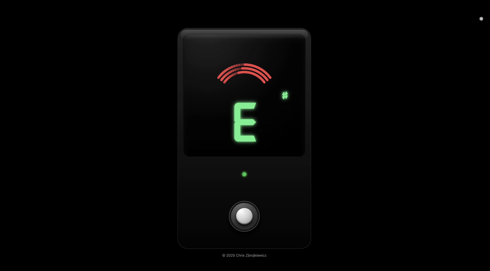

# 🎵 The Guitar Tuner

> A precise, accessible tuner built with **Vite, React, and Tailwind CSS **, combining modern web tech with a musician-friendly interface for reliable pitch detection anywhere.


---

## 🎛 Demo

👉 **[Try it live here](https://tuner-gg.netlify.app/)**

---

## ✨ Features

- 🎤 **Real-time pitch detection** (Web Audio API + [`pitchy`](https://github.com/ianprime0509/pitchy))
- 🎛️ **Arched strobe panel** that scrolls right when sharp, left when flat
- 🔠 **Large note display** with smart `♯ / ♭` accidental
- 🎚️ **Pedal footswitch** (pressed = tuner+mic ON; unpressed = OFF)
- 🖼️ **SVG pedal outline** with precise “screen” and “footswitch” slots
- 🛠️ **Debug overlays** to fine-tune slot positions inside the SVG
- 🌐 **Responsive & accessible** (keyboard toggle, `aria-pressed`, focus ring)

---

## 🖥️ Screenshots

| Preview  
| ---------------------------------------
| 

---

## ⚙️ Tech Stack

- [Vite](https://vitejs.dev/) — Next-gen build tool
- [React](https://react.dev/) — Modern UI library
- [Tailwind CSS](https://tailwindcss.com/) — Utility-first styling
- [Pitchy](https://github.com/ianprime0509/pitchy/) — Pitch Detection
- [ESLint](https://eslint.org/) + [Prettier](https://prettier.io/) — Consistent code style

---

## 🚀 Getting Started

### 1️⃣ Clone the repo

```bash
git clone https://github.com/Chris-Z-85/metronome_gg.git
cd metronome_gg
```

### 2️⃣ Install dependencies

```bash
npm install
# or
pnpm install
```

### 3️⃣ Run locally

```bash
npm run dev
```

### 4️⃣ Build for production

```bash
npm run build
```

### 5️⃣ Preview production build

```bash
npm run preview
```

## 🤝 Contributing

Contributions are welcome!

Fork the repo

Create a new branch (git checkout -b feature/my-feature)

Commit your changes

Push to your fork (git push origin feature/my-feature)

Open a Pull Request

See CONTRIBUTING.md for more details.

## 📃 License

This project is licensed under the MIT License — see LICENSE for details.

## 🙋‍♂️ Author

Chris Z
📧 chris.z@aol.com
🌐 https://chris-z.dev/
🐙 GitHub: Chris-Z-85

## ⭐️ Show Your Support

If you find this project helpful:

## ⭐️ Star this repo

🍴 Fork it

🗣️ Share it with fellow musicians!

## 📣 Feedback

Got feedback or feature requests?
Open an issue — I’d love to hear your ideas!
