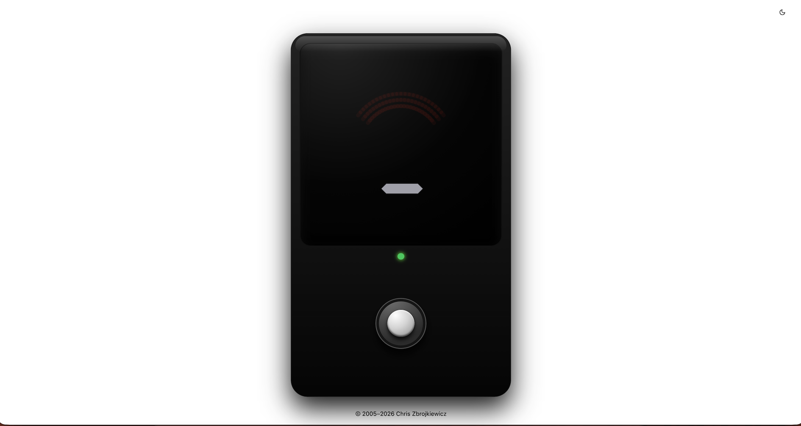
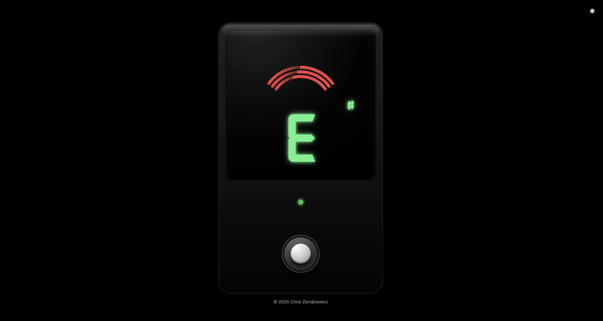

# The Guitar Tuner

The Guitar Tuner is a browser-based tuning tool designed for guitarists who want quick, reliable tuning without installing dedicated software. It provides clear visual feedback and responsive interaction to support fast adjustments during practice. The project was built to explore low-latency audio processing in the browser and simple, readable UI design.

| Light Mode                             | Dark Mode                            |
| -------------------------------------- | ------------------------------------ |
|  |  |

## Deployed

[https://guitar-tuner.netlify.app](https://guitar-tuner.netlify.app/)

## Features

- Real-time pitch detection using the Web Audio API and **pitchy**
- Arched strobe panel that scrolls right when sharp, left when flat
- Large note display with smart `♯ / ♭` accidental
- Pedal footswitch (pressed = tuner+mic ON; unpressed = OFF)
- 3D pedal outline with precise “screen” and “footswitch” slots
- Responsive & accessible (keyboard toggle, `aria-pressed`, focus ring)

## Tech Stack

- React
- Typescript
- Vite
- Web Audio API
- Pitchy
- Tailwind CSS