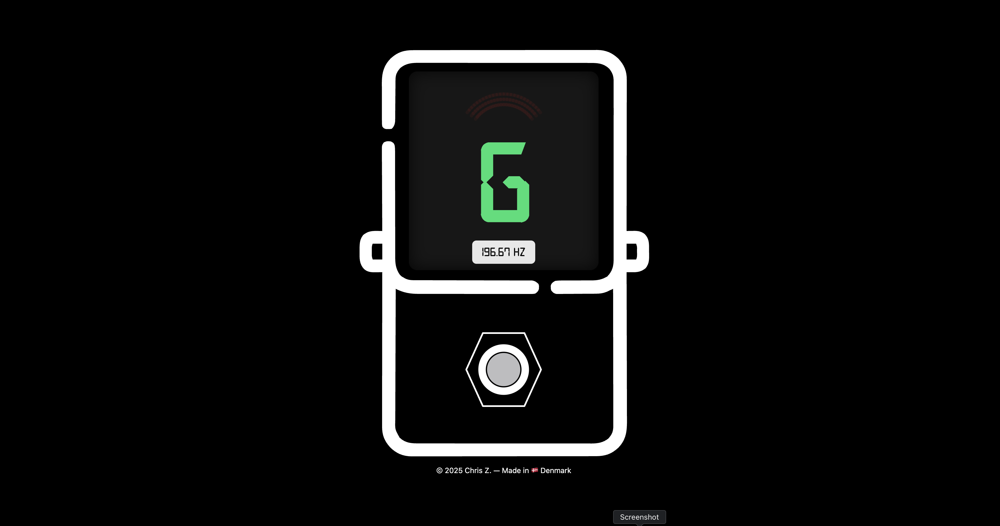

# tuner_gg

> A fast, modern, and accessible **guitar/bass tuner** built with Vite, React, and Tailwind — featuring an **arched strobe display** and a **pedal-style footswitch**.

---

## 🎛 Demo

https://tuner-gg.netlify.app

---

## ✨ Features

- **Real-time pitch detection** (Web Audio API + [`pitchy`](https://github.com/ianprime0509/pitchy))
- **Arched strobe panel** that scrolls right when sharp, left when flat
- **Large note display** with smart `♯ / ♭` accidental
- **Pedal footswitch** (pressed = tuner+mic ON; unpressed = OFF)
- **SVG pedal outline** with precise “screen” and “footswitch” slots
- **Debug overlays** to fine-tune slot positions inside the SVG
- **Responsive & accessible** (keyboard toggle, `aria-pressed`, focus ring)

---

## 🖼 Screenshots
| Preview                       
| --------------------------------------- 
|  

---

## ⚙️ Tech Stack

- **Vite** (dev/build)
- **React + TypeScript**
- **Tailwind CSS**
- **pitchy** (pitch detection)
- **ESLint + Prettier**

---

## 🚀 Getting Started

### 1) Clone

```bash
git clone https://github.com/<your-username>/tuner_gg.git
cd tuner_gg
```
